# GovBench-BR: Benchmarking e Fine-Tuning de LLMs para o Setor Público Brasileiro

<div align="center">

[](https://www.python.org/downloads/)
[](https://opensource.org/licenses/MIT)
[-purple.svg)](#-5-distribuição-estratificada-do-govbench-br-843-itens)
[](#-6-fine-tuning-lora--qlora-no-qwen-35-9b-out11_finetuning_out)
[-orange.svg)](#-7-avaliação-experimental-closed-book-e-placar-geral)
[](#-1-apresentação-institucional)

</div>

---

## 🏛️ 1. Apresentação Institucional

* **Programa:** Programas de Iniciação Científica da Universidade Federal do Piauí (UFPI / PIBIC / ICV)
* **Plano de Trabalho:** *Uma Avaliação dos Grandes Modelos de Linguagens Locais com Fine-Tuning, Soberana Geral e Soberana Específica*
* **Projeto de Pesquisa:** *Investigação de Modelos de IA e Grandes Modelos de Linguagem (Large Language Model – LLM) para Auxiliar nas Demandas Governamentais*
* **Alinhamento Estratégico:** Programa de Estruturação do Ecossistema de Dados e Software para IA do Governo Federal — Plano Brasileiro de Inteligência Artificial 2024–2028 (PBIA / MCTI)
* **Orientador:** Prof. Dr. Raimundo Santos Moura
* **Orientando / Autor:** José Victor Vieira de Oliveira
* **Repositório Oficial:** `LLM-evaluate-IC`
* **Data de Consolidação:** Agosto de 2026
* **Status de Execução:** **100% Concluído** (Pipeline de Dados, Amostragem Estratificada, Geração Sintética com Gemma 4 31B, Purificação Narrativa, Dupla Auditoria de Curadoria, Padronização de IDs, Divisão Conexa sem Vazamento *Union-Find*, Fine-Tuning QLoRA do Qwen 3.5 9B, Avaliação Experimental *Closed-Book* em 5 Modelos [840 predições], Métricas Léxicas e Semânticas [BERTimbau], Meta-Auditoria de Juízes Sintéticos [Phi-4 e Command-R7B], Gráficos em 300 DPI, Relatórios Oficiais e Visualizadores Web Interativos).

---

## 📌 2. Visão Geral e Motivação

A adoção de Grandes Modelos de Linguagem (LLMs) pela Administração Pública brasileira impõe desafios críticos de **soberania tecnológica**, **privacidade de dados** e **conformidade com a Lei Geral de Proteção de Dados (LGPD - Lei nº 13.709/2018)**. Plataformas comerciais proprietárias hospedadas no exterior (como APIs da OpenAI e DeepSeek) realizam transferência internacional de dados e podem reter informações para re-treinamento, expondo a administração a jurisdições estrangeiras (*CLOUD Act* americano de 2018).

Nesse cenário, **LLMs executados em infraestrutura local** garantem que os dados sensíveis nunca deixem a custódia do Estado. No entanto, modelos abertos globais sofrem com o sub-representação do português brasileiro (apenas ~0,09% dos dados de pré-treinamento) e falham frequentemente na terminologia normativa brasileira.

O **GovBench-BR** foi desenvolvido de ponta a ponta para responder a essas demandas:
1. **Benchmark Curado e Sintético:** Construção de 843 pares de pergunta-resposta a partir de documentos governamentais primários, com 100% de controle contra *data contamination*;
2. **Ajuste Fino Supervisionado Local (SFT/QLoRA):** Especialização do modelo aberto **Qwen 3.5 9B** em *hardware* convencional de consumo (GPU 8GB VRAM);
3. **Avaliação Comparativa Rigorosa:** Benchmark *closed-book* confrontando o modelo ajustado contra sua versão base e três dos principais *baselines* mundiais de porte comparável (**Mistral-Nemo 12B**, **Llama 3.1 8B** e **DeepSeek-R1 8B**);
4. **Auditoria de Métricas e Juízes:** Diagnóstico empírico pioneiro de **viés de verbosidade (*verbosity bias*)** em modelos juízes (*LLM-as-a-Judge*), demonstrando as limitações e a necessidade de recalibração empírica dessas ferramentas.

---

## 📚 3. Domínios Governamentais e Corpus de Dados

O corpus documental foi extraído de fontes oficiais vigentes e com atualidade recente (2024–2026), reduzindo o risco de contaminação e refletindo demandas reais do serviço público:

| Domínio | Identificador | Documentos Oficiais Primários | Total Chunks | Foco Normativo |
| :--- | :---: | :--- | :---: | :--- |
| **Legislação** | `legislacao` | Constituição Federal de 1988, Código Penal (Decreto-Lei nº 2.848/1940 com reformas 2025/2026) e LGPD (Lei nº 13.709/2018). | 1.054 | Garantias constitucionais, tipificação penal e privacidade de dados. |
| **Saúde Pública** | `saude` | Protocolos Clínicos e Diretrizes Terapêuticas (PCDTs) e Portarias de Consolidação do SUS. | 6.238 | Critérios diagnósticos, esquemas terapêuticos e fluxos clínicos do SUS. |
| **Educação** | `edu` | Lei de Diretrizes e Bases da Educação (LDB - Lei nº 9.394/1996), Plano Nacional de Educação (PNE - Lei nº 13.005/2014) e Editais do ENEM. | 425 | Organização escolar, metas educacionais e diretrizes operacionais de exames. |
| **Segurança Pública** | `seguranca` | Sistema Único de Segurança Pública (SUSP - Lei nº 13.675/2018) e Relatórios Consolidados do Atlas da Violência (IPEA/FBSP). | 487 | Governança federativa de segurança, policiamento e indicadores de violência. |
| **TOTAL** | — | **11 atos normativos e relatórios técnicos oficiais** | **8.204** | **Cobertura transversal do setor público brasileiro** |

---

## 🔄 4. Arquitetura do Pipeline (`src/` vs `out/`)

O repositório opera sob um pipeline estritamente modular, reprodutível e auditável:

```mermaid
flowchart TD
    subgraph S0["Etapa 00: Segmentação e Chunking"]
        A["Documentos Oficiais (.md)"] --> B["src/chunking/normative_chunker.py<br/>src/chunking/non_normative_chunker.py"]
        B --> C["out/00_chunks_out/all_chunks.jsonl<br/>(8.204 chunks estruturados)"]
    end

    subgraph S1["Etapa 01 a 05: Construção e Purificação do Benchmark"]
        C --> D["src/01_filter_and_sample.py<br/>src/01b_sample_replacements.py"]
        D --> E["out/01_sampling_out/<br/>(Tarefas com cotas dinâmicas)"]
        E --> F["src/02_test_model_generation.py (Piloto)"]
        F --> G["src/03_generate_govbench_br.py<br/>(Gemma 4 31B Teacher)"]
        G --> H["out/03_generation_out/ (Raw Sintético)"]
        H --> I["src/04_quality_audit.py (Camada 1: Duplicatas/Tabelas)"]
        I --> J["src/05_clean_and_update_dataset.py<br/>(Expurgo de 141 itens c/ tabela)"]
        J --> K["src/tools/standardize_ids.py<br/>(Padronização de IDs sequenciais)"]
    end

    subgraph S2["Etapa 06 a 07: Curadoria e Particionamento"]
        K --> L["src/06_llm_judge.py<br/>(Camada 2: Command-R7B + Phi-4)"]
        L --> M["out/06_llm_judge_out/<br/>(97,6% concordância na curadoria)"]
        M --> N["src/07_split_govbench.py<br/>(Union-Find sem vazamento)"]
        N --> O["out/07_splits_out/<br/>Treino: 675 itens (80,1%)<br/>Teste: 168 itens (19,9%)"]
    end

    subgraph S3["Etapa 11: Fine-Tuning QLoRA (Local)"]
        O -. Treino .-> P["src/11_train_qwen_unsloth_v2.py<br/>(Qwen 3.5 9B + QLoRA r=8)"]
        P --> Q["out/11_finetuning_out/<br/>(checkpoint-152 ótimo: 58.2 MB)"]
    end

    subgraph S4["Etapa 08 a 10: Avaliação Comparativa e Relatórios"]
        O -. Teste .-> R["src/08_evaluate_llms.py<br/>(5 Modelos: 840 predições closed-book)"]
        Q -. Adaptador .-> R
        R --> S["out/08_eval_out/<br/>(predictions.jsonl)"]
        S --> T["src/09_compute_metrics.py<br/>(ROUGE-L, F1, BERTScore, Juízes)"]
        T --> U["out/09_metrics_out/<br/>(scored_items.jsonl)"]
        U --> V["src/10_generate_plots_and_tables.py"]
        V --> W["out/10_reports_out/<br/>(6 Gráficos 300 DPI, CSVs, LaTeX)"]
        U --> X["src/tools/generate_eval_viewer.py"]
        X --> Y["src/tools/eval_metrics_viewer.html<br/>(Dashboard Interativo + Meta-Auditoria)"]
    end
```



### Mapeamento Completo de Scripts (`src/`) e Diretórios de Saída (`out/`)

| Etapa | Script em `src/` | Diretório em `out/` | Papel Metodológico no Projeto |
| :---: | :--- | :--- | :--- |
| **00** | `chunking/pipeline.py`<br/>`chunking/normative_chunker.py`<br/>`chunking/non_normative_chunker.py` | `00_chunks_out/` | Segmentador hierárquico (preserva Título, Capítulo, Artigo, Parágrafo, Inciso em normas) e por seções textuais em manuais clínicos/relatórios. |
| **01** | `01_filter_and_sample.py` | `01_sampling_out/` | Filtragem de fragmentos revogados/residuais, cotas dinâmicas por documento e agrupamento semântico TF-IDF para o estrato `aplicado`. |
| **01b**| `01b_sample_replacements.py` | `01_sampling_out/` | Amostragem de reposição orientada com predicado estrito `is_pure_content_chunk` (100% narrativo, sem tabelas, colunas ou sumários). |
| **02** | `02_test_model_generation.py` | `02_pilot_out/` | Estudo piloto experimental comparando geradores candidatos (Gemma 4 31B vs Gemma 4 4B), avaliando citação canônica e precisão formal. |
| **03** | `03_generate_govbench_br.py` | `03_generation_out/` | Geração em escala com Gemma 4 31B (*LLM-as-a-Teacher*), com taxa controlada (8k TPM) e injeção do system prompt anti-tabela. |
| **04** | `04_quality_audit.py` | `04_quality_audit_out/` | Auditoria Camada 1: rastreio de duplicatas exatas/quase-duplicatas, vazamento lexical entre estratos e detecção de listas bibliográficas. |
| **05** | `05_clean_and_update_dataset.py` | `05_cleaned_dataset_out/` | Higienização e expurgo de 141 artefatos tabulares, consolidando a base validada de 843 itens (`govbench_br_validado.jsonl`). |
| **06** | `06_llm_judge.py` | `06_llm_judge_out/` | Auditoria Camada 2: verificação cruzada por comitê duplo sintético (Command-R7B e Phi-4 14B) para consistência, completude e fundamentação. |
| **07** | `07_split_govbench.py` | `07_splits_out/` | Particionamento estratificado 80/20 via *Union-Find* (componentes conexos por chunk-fonte), assegurando divisão estritamente livre de vazamento. |
| **08** | `08_evaluate_llms.py` | `08_eval_out/` | Inferência determinística *closed-book* (temp 0) nos 168 itens de teste para os 5 modelos avaliados (840 predições totais). |
| **09** | `09_compute_metrics.py` | `09_metrics_out/` | Cálculo automatizado de métricas léxicas (ROUGE-L, Token-F1), semânticas (BERTScore com BERTimbau) e avaliação qualitativa por juízes. |
| **10** | `10_generate_plots_and_tables.py` | `10_reports_out/` | Geração de sumários estatísticos em CSV, tabelas prontas em LaTeX e 6 figuras de alta resolução (300 DPI) para publicações. |
| **11** | `11_train_qwen_unsloth_v2.py` | `11_finetuning_out/` | Treinamento SFT/QLoRA do Qwen 3.5 9B em ambiente WSL2/CUDA com restauração automática do melhor *checkpoint* (`checkpoint-152`). |
| **Fix**| `patch_backfill_chunk_texto.py` | `08_eval_out/` | Injeção retroativa e alinhamento do trecho-fonte (`chunk_texto`) nas predições para viabilizar ancoragem (*grounding*) aos juízes. |
| **Tool**| `tools/standardize_ids.py` | `05_cleaned_dataset_out/` | Renumeração canônica sequencial de 100% dos pares QA no formato `{dominio}_{dificuldade}_{index:04d}`. |
| **Tool**| `tools/generate_eval_viewer.py` | `src/tools/` | Gerador e mantenedor da aplicação web interativa standalone (`eval_metrics_viewer.html`) com meta-auditoria humana. |
| **Tool**| `tools/generate_visualizer.py` | `src/tools/` | Visualizador interativo geral do benchmark completo (`benchmark_explorer.html`). |
| **Tool**| `tools/apply_judge_validations.py` | `src/tools/` | Incorporador de validações humanas consolidadas no dataset permanente. |

---

## 📊 5. Distribuição Estratificada do GovBench-BR (843 itens)

O benchmark final é composto por **843 itens de alta qualidade**, rigorosamente balanceados entre 12 estratos (`4 domínios × 3 níveis de complexidade cognitiva`):

| Domínio | Nível de Dificuldade | Total de Itens | Treino (80,1%) | Teste (19,9%) | Tipo de Desafio Cognitivo |
| :--- | :--- | :---: | :---: | :---: | :--- |
| **Educação** | Aplicado | 70 | 56 | 14 | Casos concretos combinando LDB, resoluções e diretrizes do ENEM. |
| **Educação** | Conceitual | 77 | 62 | 15 | Diretrizes curriculares, princípios formativos e metas do PNE. |
| **Educação** | Factual | 70 | 56 | 14 | Citações diretas de artigos, percentuais e obrigações expressas. |
| **Legislação** | Aplicado | 85 | 68 | 17 | Hipóteses fáticas integrando Código Penal, garantias constitucionais e LGPD. |
| **Legislação** | Conceitual | 100 | 80 | 20 | Definições jurídicas, limites de direitos e competências institucionais. |
| **Legislação** | Factual | 61 | 49 | 12 | Prazos legais, sanções tarifadas e tipificações literais de crimes. |
| **Saúde** | Aplicado | 64 | 51 | 13 | Casos clínicos hipotéticos exigindo conduta conforme PCDTs do SUS. |
| **Saúde** | Conceitual | 73 | 58 | 15 | Critérios de inclusão/exclusão em terapias e fundamentos do SUS. |
| **Saúde** | Factual | 76 | 61 | 15 | Dosagens padronizadas, exames diagnósticos obrigatórios e prazos. |
| **Segurança** | Aplicado | 51 | 41 | 10 | Articulação entre forças de segurança no SUSP e cenários operacionais. |
| **Segurança** | Conceitual | 48 | 39 | 9 | Princípios do SUSP, integração federativa e governança em segurança. |
| **Segurança** | Factual | 68 | 54 | 14 | Atribuições legais dos órgãos de segurança e estatísticas do Atlas. |
| **TOTAL** | — | **843** | **675 itens** | **168 itens** | **Garantia de 9 a 20 itens por estrato no conjunto de Teste** |

### Garantias de Qualidade e Integridade
* **Particionamento Conexo (*Union-Find*):** Nenhum trecho-fonte (`chunk_id`) presente no conjunto de teste é compartilhado com o treino, eliminando vazamento de dados em itens de nível aplicado.
* **Validade Estrutural:** 100% dos registros JSON válidos com zero campos nulos.
* **Pureza Narrativa:** 0% de resíduos de tabelas, eixos ou marcadores sintéticos nos pares QA.

---

## ⚡ 6. Fine-Tuning LoRA / QLoRA no Qwen 3.5 9B (`out/11_finetuning_out/`)

O ajuste fino supervisionado foi executado no modelo de fundação **Qwen 3.5 9B** (`unsloth/Qwen3.5-9B`) sob precisão 4-bit (QLoRA / NF4) utilizando o framework **Unsloth** em GPU NVIDIA RTX 4070 Laptop (8GB VRAM) sob Ubuntu WSL2.

### 6.1 Comparativo Experimental entre Versões de Treino

A investigação realizou duas rodadas controladas, analisando o impacto do rank do adaptador ($r$) e a dinâmica de sobreajuste:

| Hiperparâmetro / Métrica | Versão 1 (`v1` - Piloto) | Versão 2 (`v2` - 2 Épocas) | Versão 2 (`v2` - 3 Épocas c/ `--resume`) |
| :--- | :---: | :---: | :---: |
| **Script Utilizado** | `src/11_train_qwen_unsloth.py` | `src/11_train_qwen_unsloth_v2.py` | `src/11_train_qwen_unsloth_v2.py --resume` |
| **LoRA Rank ($r$) / Alpha ($\alpha$)** | $r = 16$, $\alpha = 16$ | **$r = 8$, $\alpha = 16$** | **$r = 8$, $\alpha = 16$** |
| **Parâmetros Treináveis** | 29.097.984 (0,31%) | **14.548.992 (0,15%)** | **14.548.992 (0,15%)** |
| **Épocas / Passos (Steps)** | 3.0 épocas (228 steps) | 2.0 épocas (152 steps) | **3.0 épocas (228 steps totais)** |
| **Tempo de Execução** | 43.507 s (~12,1 h) | 26.310 s (~7,3 h) | **+14.288 s (~3,9 h na 3ª época)** |
| **Perda de Treino Inicial** | `1.8453` (Step 5) | `1.8503` (Step 5) | `1.8503` (Step 5) |
| **Perda de Treino Final** | `0.6323` (Step 228) | `0.9587` (Step 150) | `0.8210` (Step 228) |
| **Menor Perda de Validação** | `0.9213` (Step 140) | **`0.9270` (Step 152)** | **`0.9270` (Step 152 / Época 2.0)** |
| **Perda de Validação Final** | `0.9555` (Step 228) | `0.9270` (Step 152) | `0.9287` (Step 228) |
| **Variação Pós-Mínimo** | +3,71% (Sobreajuste) | — | **+0,18% (Estabilidade perfeita)** |
| **Tamanho do Adaptador** | 116.4 MB | 58.2 MB | **58.2 MB** (`checkpoint-152`) |

### 6.2 Conclusões Metodológicas do Treinamento
1. **Regularização Intrínseca por Rank Menor ($r=8$):** A redução de $r=16$ para $r=8$ (forçada por restrição de VRAM) reduziu os parâmetros treináveis pela metade e funcionou como excelente regularizador, eliminando o sobreajuste observado em `v1` (+3,71% de degradação) e alcançando perda de validação praticamente equivalente (0.9270 vs 0.9213, variação de apenas 0,6%);
2. **Ponto Ótimo Global no Step 152:** A extensão controlada comprovou que o melhor modelo foi consolidado ao final da 2ª época (Step 152). O mecanismo `load_best_model_at_end` garantiu a restauração automática do `checkpoint-152` para a fase de testes.

---

## 🏆 7. Avaliação Experimental Closed-Book e Placar Geral

O conjunto de teste com **168 itens inéditos** foi submetido à inferência determinística *closed-book* (apenas a pergunta no *prompt*, sem trecho contextual, temperatura 0) em 5 modelos, totalizando **840 predições avaliadas**:

### 7.1 Placar Geral Consolidado (Overall Benchmark Scorecard)

*Dados oficiais de `out/09_metrics_out/summary_by_model.json` e `out/10_reports_out/summary_overall.csv`:*

| Modelo Avaliado | ROUGE-L | Token F1 | BERTScore (F1) | Juiz Phi-4 (1–5) | Juiz Cmd-R (1–5) | Alucinação Phi-4 | Alucinação Cmd-R | Latência Média | Janelamento (>450 tks) | Resposta Vazia |
| :--- | :---: | :---: | :---: | :---: | :---: | :---: | :---: | :---: | :---: | :---: |
| **Qwen 3.5 9B (Fine-Tuned)** 🏆 | **0.3499** | **0.3948** | **0.6891** | ⭐ **1.60** | ⭐ **2.50** | **88.0%** | **69.1%** | **18.85 s** | **3.6%** | **0.0%** |
| **Mistral-Nemo (12B)** | 0.2130 | 0.2645 | 0.6401 | ⭐ 1.59 | ⭐ 2.92 | 89.7% | 52.1% | 17.46 s | 5.4% | 0.0% |
| **Llama 3.1 (8B)** | 0.1813 | 0.2215 | 0.5734 | ⭐ 1.28 | ⭐ 2.39 | 93.3% | 66.5% | 8.08 s | 1.2% | 0.0% |
| **DeepSeek-R1 (8B)** | 0.1703 | 0.2008 | 0.5903 | ⭐ 1.39 | ⭐ 3.08 | 92.7% | 48.2% | 24.97 s | 42.9% | 0.0% |
| **Qwen 3.5 9B (Base)** | 0.1218 | 0.1479 | 0.5869 | ⭐ 1.53 | ⭐ 3.88 | 87.1% | 24.4% | 67.73 s | 76.8% | 0.0% |

### 7.2 Ganho Relativo do Fine-Tuning LoRA
* **vs Qwen 3.5 9B Base (Mesma arquitetura):** Salto de **+187.3% em ROUGE-L** (de 0.1218 para 0.3499), **+166.9% em Token-F1** e **+17.4% em BERTScore** (+10.2 pontos percentuais). A latência caiu **72,2%** (de 67.73 s para 18.85 s), extinguindo o monólogo interno não guiado.
* **vs Mistral-Nemo 12B (Melhor baseline externo):** Vantagem de **+64.3% em ROUGE-L** e **+7.7% em BERTScore**, superando um modelo com 33% mais parâmetros.
* **vs Llama 3.1 8B:** Superioridade de **+93.0% em ROUGE-L** e **+20.2% em BERTScore**.

---

## 🔬 8. Análise Estratificada: Domínio e Dificuldade

### 8.1 Desempenho por Domínio Governamental (ROUGE-L / BERTScore)

| Modelo | Legislação | Saúde Pública | Educação | Segurança Pública |
| :--- | :---: | :---: | :---: | :---: |
| **Qwen 3.5 9B (Fine-Tuned)** 🏆 | **0.349 / 0.697** | **0.336 / 0.688** | **0.359 / 0.689** | **0.356 / 0.679** |
| Mistral-Nemo (12B) | 0.208 / 0.650 | 0.198 / 0.641 | 0.211 / 0.629 | 0.241 / 0.639 |
| Llama 3.1 (8B) | 0.181 / 0.591 | 0.151 / 0.540 | 0.197 / 0.586 | 0.200 / 0.573 |
| DeepSeek-R1 (8B) | 0.178 / 0.597 | 0.143 / 0.586 | 0.168 / 0.589 | 0.197 / 0.588 |
| Qwen 3.5 9B (Base) | 0.125 / 0.595 | 0.099 / 0.588 | 0.137 / 0.585 | 0.127 / 0.576 |

*O modelo ajustado exibe ganho uniforme em todos os quatro domínios, com solidez particular no domínio normativo de Educação e Legislação.*

### 8.2 Desempenho por Nível de Dificuldade (ROUGE-L / BERTScore)

| Modelo | Factual (Extração Direta) | Conceitual (Interpretação e Princípios) | Aplicado (Cenários Multidoc) |
| :--- | :---: | :---: | :---: |
| **Qwen 3.5 9B (Fine-Tuned)** 🏆 | **0.432 / 0.712** | **0.279 / 0.650** | **0.344 / 0.708** |
| Mistral-Nemo (12B) | 0.235 / 0.625 | 0.181 / 0.627 | 0.225 / 0.669 |
| Llama 3.1 (8B) | 0.184 / 0.555 | 0.169 / 0.581 | 0.192 / 0.584 |
| DeepSeek-R1 (8B) | 0.177 / 0.574 | 0.148 / 0.580 | 0.188 / 0.618 |
| Qwen 3.5 9B (Base) | 0.130 / 0.568 | 0.113 / 0.584 | 0.123 / 0.610 |

*O impacto do fine-tuning é dominante em itens Factuais (ROUGE-L quase o dobro do segundo colocado), evidenciando a memorização paramétrica de regras numéricas, prazos e tipificações.*

---

## ⚖️ 9. Auditoria dos Juízes LLM e Descoberta do Viés de Verbosidade

Uma das principais contribuições científicas do trabalho reside na meta-auditoria da confiabilidade dos próprios juízes sintéticos (*LLM-as-a-Judge*).

### 9.1 A Contradição Aparente e a Descoberta do Viés
Ao analisar o Placar Geral, observou-se que o juiz **Command-R7B** atribuiu a maior nota média ao **Qwen 3.5 Base (3.88)**, justamente o modelo com pior ROUGE-L (0.1218) e mais lenta geração (67.73 s). A auditoria quantitativa revelou a raiz do fenômeno: **Viés de Verbosidade (*Verbosity Bias*)**.

| Métrica de Auditoria do Juiz | Command-R7B (Antes do Patch) | Command-R7B (Após Patch) | Phi-4 14B (Antes do Patch) | Phi-4 14B (Após Patch) |
| :--- | :---: | :---: | :---: | :---: |
| **Correlação Tamanho da Resposta × Nota** | **+0,306** | **+0,350** (Viés Estrutural) | +0,139 | **+0,012** (Viés Neutralizado) |
| **Confrontos Diretos (Só Base Vence : Só FT Vence)** | 68 : 5 | **76 : 8** (Severamente enviesado) | — | **14 : 14** (Totalmente equilibrado) |

* **Command-R7B:** Treinado primariamente para síntese em RAG, o Command-R associou prolixidade e respostas longas à competência, mesmo quando o modelo Base inventava leis fictícias (ex: criar um sistema imaginário *"Meu Enem"* e aprovar a resposta com nota máxima).
* **Phi-4 14B:** Respondeu perfeitamente à injeção do trecho-fonte (`chunk_texto`) e a instruções anti-verbosidade, anulando a correlação espúria com extensão (+0,012) e demonstrando rigor analítico em penalizar alucinações. Por essa razão, o **Phi-4 foi adotado como juiz canônico primário**, com o Command-R mantido como sinal secundário por transparência.

### 9.2 Matriz de Consenso entre Juízes (168 Itens de Teste)

| Modelo | Corretos (Cmd-R) | Corretos (Phi-4) | Consenso: Ambos Aprovam | Ambos Rejeitam | Discordância |
| :--- | :---: | :---: | :---: | :---: | :---: |
| **Qwen 3.5 9B (Fine-Tuned)** | 48 (28,6%) | 21 (12,5%) | 🤝 **19 (11,3%)** | ❌ **118 (70,2%)** | ⚡ **31 (18,5%)** |
| **Mistral-Nemo (12B)** | 77 (45,8%) | 17 (10,1%) | 🤝 15 (8,9%) | ❌ 89 (53,0%) | ⚡ 64 (38,1%) |
| **Llama 3.1 (8B)** | 45 (26,8%) | 10 (6,0%) | 🤝 9 (5,4%) | ❌ 122 (72,6%) | ⚡ 37 (22,0%) |
| **DeepSeek-R1 (8B)** | 83 (49,4%) | 13 (7,7%) | 🤝 13 (7,7%) | ❌ 85 (50,6%) | ⚡ 70 (41,7%) |
| **Qwen 3.5 9B (Base)** | 117 (69,6%) | 21 (12,5%) | 🤝 20 (11,9%) | ❌ 50 (29,8%) | ⚡ 98 (58,3%) |

---

## 📈 10. Catálogo de Figuras Científicas (`out/10_reports_out/plots/`)

Todas as figuras foram produzidas em resolução de publicação acadêmica (300 DPI) pelo script `src/10_generate_plots_and_tables.py`:

| Arquivo PNG | Conteúdo e Descrição Científica |
| :--- | :--- |
| `plots/01_overall_metrics_comparison.png` | Comparação em barras de ROUGE-L, Token-F1 e BERTScore entre os 5 modelos avaliados. |
| `plots/02_judge_scores_and_hallucinations.png` | Dispersão das notas atribuídas por Phi-4 e Command-R e taxa percentual de alucinação. |
| `plots/03_domain_radar_and_bars.png` | Radar e barras comparativas de performance pelos 4 domínios da administração pública. |
| `plots/04_difficulty_performance.png` | Curvas de desempenho estratificado por nível cognitivo (Factual, Conceitual e Aplicado). |
| `plots/05_lora_relative_gain.png` | Gráfico de ganho percentual relativo do modelo Fine-Tuned frente a todos os competidores. |
| `plots/06_judge_agreement_breakdown.png` | Decomposição de consenso (Ambos Aprovam, Ambos Rejeitam, Discordância) entre juízes. |

---

## 💻 11. Visualizadores Web e Meta-Auditoria Humana (`src/tools/`)

Para assegurar auditabilidade qualitativa e cumprir as diretrizes da **Fase de Integração (FI)** do plano de trabalho de IC, o repositório disponibiliza ferramentas web *standalone* em Vanilla JS/CSS (sem dependências externas de servidor):

### 11.1 Dashboard de Avaliação & Meta-Auditoria (`src/tools/eval_metrics_viewer.html`)
* **Painel "Sobre este protótipo":** Banner contextualizador conectando explicitamente a ferramenta ao Relatório Final do GovBench-BR e ao plano de trabalho PIBIC/ICV;
* **Scorecard Interativo:** KPIs completos, filtros multidimensionais por modelo, domínio, nível e padrão de consenso de juízes;
* **Comparador Head-to-Head:** Inspeção lado a lado de qualquer uma das 168 perguntas, confrontando gabarito oficial e as 5 predições simultâneas;
* **Meta-Avaliação Humana:** Módulo que permite ao pesquisador auditar cada parecer dos juízes sintéticos (botões 👍 Juiz Acertou / 👎 Juiz Errou), com anotação textual, persistência em `localStorage` e **exportação em arquivo JSON** (`govbench_judge_meta_evaluations.json`).

### 11.2 Explorador do Benchmark Completo (`src/tools/benchmark_explorer.html`)
* Navegador analítico dos 843 itens do GovBench-BR com busca textual em tempo real, visualização de trechos normativos fontes e metadados de auditoria.

---

## 🚀 12. Instalação, Configuração e Reprodução

### 12.1 Clonagem e Dependências
```bash
# Clone o repositório
git clone https://github.com/usuario/LLM-evaluate-IC.git
cd LLM-evaluate-IC

# Crie e ative o ambiente virtual
python -m venv venv
source venv/bin/activate  # No Windows (PowerShell): .\venv\Scripts\Activate.ps1

# Instale os pacotes necessários
pip install -r requirements.txt
```

### 12.2 Variáveis de Ambiente (`.env`)
Para etapas que envolvem chamadas de API (como a geração com Gemma 4 31B):
```env
GEMINI_API_KEY=sua_chave_gemini_aqui
```

### 12.3 Executando o Pipeline Completo de Reprodução

#### 1. Construção e Curadoria do Benchmark
```bash
# Amostragem com cotas dinâmicas e agrupamento TF-IDF
python src/01_filter_and_sample.py --input 00_chunks_out/all_chunks.jsonl --output-dir 01_sampling_out

# Amostragem de reposição narrativa pura
python src/01b_sample_replacements.py

# Geração sintética oficial (Gemma 4 31B Teacher)
python src/03_generate_govbench_br.py --tasks 01_sampling_out/generation_tasks.jsonl --model gemini/gemma-4-31b-it --output 03_generation_out/govbench_br_raw_gemma4-31b.jsonl

# Auditoria Camada 1 (Duplicatas e resíduos)
python src/04_quality_audit.py --input 03_generation_out/govbench_br_raw_gemma4-31b.jsonl --output-dir 04_quality_audit_out

# Higienização e expurgo de tabelas
python src/05_clean_and_update_dataset.py

# Padronização de identificadores canônicos
python src/tools/standardize_ids.py

# Auditoria Camada 2 (LLM-as-a-Judge Duplo)
python src/06_llm_judge.py --input 05_cleaned_dataset_out/govbench_br.jsonl --judges ollama/command-r7b,ollama/phi4:14b --output-dir 06_llm_judge_out

# Particionamento estratificado Union-Find (Treino 675 / Teste 168)
python src/07_split_govbench.py --input 05_cleaned_dataset_out/govbench_br.jsonl --output-dir 07_splits_out
```

#### 2. Fine-Tuning Supervisionado (QLoRA)
*Executado no ambiente Unsloth / WSL2:*
```bash
# Treinamento QLoRA v2 (checkpoint-152)
python src/11_train_qwen_unsloth_v2.py --train-file out/07_splits_out/govbench_br_validado_train.jsonl --output-dir out/11_finetuning_out/
```

#### 3. Avaliação, Métricas e Relatórios
```bash
# Inferência closed-book dos modelos candidatos (via LiteLLM / Ollama / Unsloth)
python src/08_evaluate_llms.py --test-file out/07_splits_out/govbench_br_validado_test.jsonl --output-dir out/08_eval_out

# Cálculo de ROUGE-L, Token-F1, BERTScore (BERTimbau) e pareceres dos juízes
python src/09_compute_metrics.py --predictions out/08_eval_out/predictions.jsonl --output-dir out/09_metrics_out --use-judge

# Geração de tabelas LaTeX, sumários CSV e gráficos 300 DPI
python src/10_generate_plots_and_tables.py --eval-dir out/09_metrics_out --output-dir out/10_reports_out

# Regeneração do Visualizador Web Interativo
python src/tools/generate_eval_viewer.py
```

---

## 🎯 13. Conclusões Principais e Recomendações

1. **Eficácia Comprovada do Fine-Tuning Local:** O ajuste fino especializado em normas brasileiras triplicou o desempenho lexical (+187.3% ROUGE-L) e aumentou significativamente a similaridade contextual (+17.4% BERTScore), convertendo o modelo aberto Qwen 3.5 9B no mais assertivo e conciso do benchmark;
2. **Superioridade do BERTScore com BERTimbau:** Métricas puramente baseadas em n-gramas (ROUGE/F1) penalizam severamente paráfrases jurídicas legítimas. O BERTScore contextualizado em língua portuguesa mostrou-se essencial para capturar equivalências semânticas ricas;
3. **Limitações do Regime Closed-Book e Risco de Alucinação:** Mesmo com a nítida superioridade do modelo ajustado, a taxa de alucinação factual de entidades específicas (nomes de sistemas, dosagens, órgãos recursais) permaneceu elevada (~88%). **Conclusão:** LLMs locais não devem atuar de forma 100% autônoma em decisões de governo sem arquiteturas de recuperação ancorada (**RAG**) ou auditoria humana permanente;
4. **Alerta Metodológico sobre Juízes Sintéticos:** A avaliação empírica comprovou que juízes LLM são suscetíveis a severo viés de verbosidade. O uso de *LLM-as-a-Judge* exige validação cruzada, ancoragem estrita no trecho-fonte original e recalibração empírica contínua.
