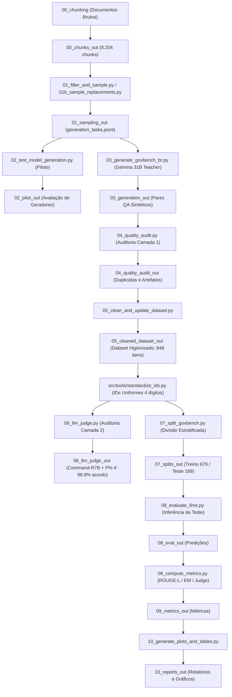

# GovBench-BR: Benchmarking e Fine-Tuning de LLMs para o Setor Público Brasileiro

**Projeto de Iniciação Científica (IC):** Investigação de Modelos de IA e Grandes Modelos de Linguagem (Large Language Model – LLM) para Auxiliar nas Demandas Governamentais  
**Autor:** José Victor (Pesquisador de IC)  
**Status do Projeto:** Pipeline de Dados, Amostragem, Geração Sintética, Purificação Narrativa, Auditoria Dupla (Camada 1 e Camada 2), Padronização de IDs e Divisão Estratificada **Concluídos** | **Em andamento:** Fine-Tuning (SFT/QLoRA) e Avaliação Experimental em LLMs Locais.

---

## 📌 1. Visão Geral

O **GovBench-BR** é um benchmark nacional estruturado, higienizado e auditado para avaliação e ajuste fino (*fine-tuning*) de Modelos de Linguagem de Grande Porte (LLMs) em tarefas de resposta a perguntas baseadas em documentos e normativas do setor público brasileiro.

O repositório contém todo o pipeline reproduzível: desde a extração estruturada de documentos governamentais brutos (*chunking* especializado), amostragem por relevância e complexidade, amostragem de reposição narrativa pura (sem tabelas), geração sintética supervisionada (*LLM-as-a-Teacher* com Gemma 4 31B), auditoria automatizada em duas camadas (regras estáticas + *LLM-as-a-Judge* duplo com Command-R7B e Phi-4), padronização sequencial de IDs, visualizador interativo web, até a divisão estratificada dos datasets de **Treino** (679 itens) e **Teste** (169 itens).

---

## 🏛️ 2. Corpus e Domínios Cobertos

O benchmark abrange quatro domínios estratégicos da administração pública brasileira:

1. **Legislação (`legislacao`):** Constituição Federal de 1988, Código Penal (Decreto-Lei nº 2.848/1940) e Lei Geral de Proteção de Dados (LGPD - Lei nº 13.709/2018).
2. **Saúde Pública (`saude`):** Protocolos Clínicos e Diretrizes Terapêuticas (PCDTs) do Ministério da Saúde e Portarias do SUS.
3. **Educação (`edu`):** Lei de Diretrizes e Bases da Educação Nacional (LDB - Lei nº 9.394/1996), Plano Nacional de Educação (PNE - Lei nº 13.005/2014) e Editais do ENEM.
4. **Segurança Pública (`seguranca`):** Sistema Único de Segurança Pública (SUSP - Lei nº 13.675/2018) e relatórios do Atlas da Violência.

---

## 🔄 3. Arquitetura do Pipeline e Estrutura de Pastas

A arquitetura foi projetada de forma estritamente sequencial, modular e auditável. Cada etapa do pipeline possui scripts dedicated em `src/` e pastas de ferramentas em `src/tools/`:



---

## 📜 4. Mapeamento de Scripts e Ferramentas

| Etapa | Script | Pasta de Saída | Descrição da Função |
| :--- | :--- | :--- | :--- |
| **00** | `src/chunking/` | `00_chunks_out/` | Processador especializado normativo e não-normativo de Markdown para JSONL. |
| **01** | `src/01_filter_and_sample.py` | `01_sampling_out/` | Filtro de qualidade, cotas por documento e agrupamento TF-IDF para o nível `aplicado`. |
| **01b**| `src/01b_sample_replacements.py` | `01_sampling_out/` | Amostragem de reposição focada exclusivamente em chunks 100% narrativos (sem tabelas). |
| **02** | `src/02_test_model_generation.py` | `02_pilot_out/` | Teste piloto comparativo entre geradores (Gemma 31B vs Gemma 4B vs Qwen). |
| **03** | `src/03_generate_govbench_br.py` | `03_generation_out/` | Geração em escala com LLM Teacher (Gemma 4 31B) com suporte a limite de taxa (16k TPM). |
| **04** | `src/04_quality_audit.py` | `04_quality_audit_out/` | Auditoria Camada 1: detecção de duplicatas exatas/paráfrases, sobreposição lexical e fontes bibliográficas. |
| **05** | `src/05_clean_and_update_dataset.py` | `05_cleaned_dataset_out/` | Expurgo de 141 artefatos contendo tabelas/sumários e geração do dataset limpo (`govbench_br.jsonl`). |
| **06** | `src/06_llm_judge.py` | `06_llm_judge_out/` | Auditoria Camada 2: avaliação cruzada com juízes duplos (**Command-R7B** e **Phi-4 14B**). |
| **07** | `src/07_split_govbench.py` | `07_splits_out/` | Divisão estratificada 80/20 sem vazamento de dados (`train.jsonl` e `test.jsonl`). |
| **08** | `src/08_evaluate_llms.py` | `08_eval_out/` | Inferência automatizada nos 169 itens de teste para modelos locais (Ollama) ou APIs. |
| **09** | `src/09_compute_metrics.py` | `09_metrics_out/` | Cálculo de ROUGE-L, Token-F1, Exact Match de citação (`trechos_usados`) e LLM-Judge score. |
| **10** | `src/10_generate_plots_and_tables.py` | `10_reports_out/` | Consolidação de relatórios comparativos em Markdown e geração de gráficos PNG. |
| **Tool**| `src/tools/standardize_ids.py` | `05_cleaned_dataset_out/` | Renumeração sequencial de IDs no formato `{dominio}_{dificuldade}_{index:04d}`. |
| **Tool**| `src/tools/generate_visualizer.py` | `src/tools/` | Gerador da aplicação web interativa standalone (`benchmark_explorer.html`). |
| **-**  | `src/govbench_common.py` | - | Prompts do gerador (`REGRA_ANTI_TABELA`), prompts do juiz, parsers de JSON e chamadas LiteLLM. |

---

## 📊 5. Estatísticas do GovBench-BR Consolidado (848 itens)

Após os filtros automatizados de auditoria, expurgo de artefatos de tabelas e reposição narrativa, o benchmark consolidado é composto por **848 itens** com a seguinte distribuição estratificada por `(domínio x dificuldade)`:

| Domínio | Nível de Dificuldade | Total | Treino (80,1%) | Teste (19,9%) |
| :--- | :--- | :---: | :---: | :---: |
| **Educação** | Aplicado | 70 | 56 | 14 |
| **Educação** | Conceitual | 77 | 62 | 15 |
| **Educação** | Factual | 70 | 56 | 14 |
| **Legislação** | Aplicado | 85 | 68 | 17 |
| **Legislação** | Conceitual | 100 | 80 | 20 |
| **Legislação** | Factual | 61 | 49 | 12 |
| **Saúde** | Aplicado | 64 | 51 | 13 |
| **Saúde** | Conceitual | 73 | 58 | 15 |
| **Saúde** | Factual | 76 | 61 | 15 |
| **Segurança** | Aplicado | 51 | 41 | 10 |
| **Segurança** | Conceitual | 48 | 39 | 9 |
| **Segurança** | Factual | 68 | 54 | 14 |
| **TOTAL** | | **843** | **675 itens** | **168 itens** |

### 🛡️ Indicadores de Qualidade do Benchmark
- **JSONs Válidos & Campos Nulos:** 100% válidos \| 0 nulos.
- **Artefatos de Tabelas e Eixos:** 0% (todos expurgados ou substituídos por pares 100% narrativos).
- **Nomeação de IDs Uniforme:** 100% dos IDs padronizados de 4 dígitos (ex: `seguranca_factual_0001` a `seguranca_factual_0069`).
- **Garantia por Estrato:** Todos os 12 estratos possuem entre **10 e 20 itens no conjunto de Teste** (superando o requisito mínimo de 8 itens por estrato).
- **Auditoria Dupla de Juízes:** Validado com **Command-R7B** (fidelidade a contexto) e **Phi-4 14B** (raciocínio lógico) via Ollama, obtendo **98,9% de taxa de concordância** e **99,4% de aprovação unânime**.
- **Exploração Visual:** Aplicação web interativa disponível em `src/tools/benchmark_explorer.html`.

---

## 🛠️ 6. Instalação e Execução

### 6.1 Pré-requisitos e Instalação
```bash
# Clone o repositório
git clone https://github.com/usuario/LLM-evaluate-IC.git
cd LLM-evaluate-IC

# Crie e ative o ambiente virtual
python -m venv venv
source venv/bin/activate  # No Windows: .\venv\Scripts\activate

# Instale as dependências
pip install -r requirements.txt
```

### 6.2 Configuração do `.env`
Crie um arquivo `.env` na raiz do projeto com suas chaves de API:
```env
GEMINI_API_KEY=sua_chave_gemini_aqui
```

### 6.3 Executando o Pipeline Completo

1. **Amostragem de Tarefas:**
   ```bash
   python src/01_filter_and_sample.py --input 00_chunks_out/all_chunks.jsonl --output-dir 01_sampling_out
   ```
2. **Geração Sintética com Gemma 31B (Teacher):**
   ```bash
   python src/03_generate_govbench_br.py --tasks 01_sampling_out/generation_tasks.jsonl --model gemini/gemma-4-31b-it --output 03_generation_out/govbench_br_raw_gemma4-31b.jsonl
   ```
3. **Auditoria Camada 1:**
   ```bash
   python src/04_quality_audit.py --input 03_generation_out/govbench_br_raw_gemma4-31b.jsonl --output-dir 04_quality_audit_out
   ```
4. **Higienização e Mescla:**
   ```bash
   python src/05_clean_and_update_dataset.py
   ```
5. **Padronização de IDs:**
   ```bash
   python src/tools/standardize_ids.py
   ```
6. **Auditoria Camada 2 (LLM-as-a-Judge Duplo):**
   ```bash
   python src/06_llm_judge.py --input 05_cleaned_dataset_out/govbench_br.jsonl --judges ollama/command-r7b,ollama/phi4:14b --output-dir 06_llm_judge_out
   ```
7. **Divisão Estratificada (Treino / Teste):**
   ```bash
   python src/07_split_govbench.py --input 05_cleaned_dataset_out/govbench_br.jsonl --output-dir 07_splits_out
   ```
8. **Inferência de Teste em LLM Local (ex: Qwen 3.5 9B):**
   ```bash
   python src/08_evaluate_llms.py --test-file 07_splits_out/govbench_br_raw_gemma4-31b_clean_test.jsonl --model ollama/qwen3.5:9b --output-dir 08_eval_out
   ```
9. **Cálculo de Métricas:**
   ```bash
   python src/09_compute_metrics.py --predictions 08_eval_out/ollama_qwen3.5_9b_predictions.jsonl --output-dir 09_metrics_out --use-judge
   ```
10. **Consolidação do Relatório Final:**
    ```bash
    python src/10_generate_plots_and_tables.py --eval-dir 09_metrics_out --output-dir 10_reports_out
    ```

---

## 🔮 7. Próximos Passos do Projeto de IC

- **Fine-Tuning (SFT / QLoRA):** Ajuste fino do modelo aberto local **Qwen 3.5 9B** utilizando os **679 itens do conjunto de treino** (`07_splits_out/govbench_br_raw_gemma4-31b_clean_train.jsonl`).
- **Bateria de Testes Comparativa:** Avaliação experimental nos **168 itens de teste** comparando o modelo base pura vs modelo fine-tunado vs baselines.
- **Artigo Final e Publicação:** Síntese dos resultados quantitativos e qualitativos para o relatório final da IC e submissão acadêmica.
