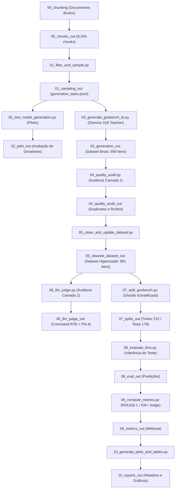

# GovBench-BR: Benchmarking e Fine-Tuning de LLMs para o Setor Público Brasileiro

**Projeto de Iniciação Científica (IC):** Investigação de Modelos de IA e Grandes Modelos de Linguagem (Large Language Model – LLM) para Auxiliar nas Demandas Governamentais  
**Autor:** José Victor (Pesquisador de IC)  
**Status do Projeto:** Pipeline de Dados, Amostragem, Geração Sintética, Auditoria Dupla (Camada 1 e Camada 2) e Divisão Estratificada **Concluídos** | **Em andamento:** Fine-Tuning (SFT/QLoRA) e Avaliação Experimental em LLMs Locais.

---

## 📌 1. Visão Geral

O **GovBench-BR** é um benchmark nacional estruturado e auditado para avaliação e ajuste fino (*fine-tuning*) de Modelos de Linguagem de Grande Porte (LLMs) em tarefas de resposta a perguntas baseadas em documentos e normativas do setor público brasileiro.

O repositório contém todo o pipeline reproduzível: desde a extração estruturada de documentos governamentais brutos (*chunking* especializado), amostragem estratificada por relevância e complexidade, geração sintética supervisionada (*LLM-as-a-Teacher*), auditoria automatizada em duas camadas (regras estáticas + *LLM-as-a-Judge* duplo com Command-R7B e Phi-4), até a divisão estratificada dos datasets de **Treino** (722 itens) e **Teste** (179 itens).

---

## 🏛️ 2. Corpus e Domínios Cobertos

O benchmark abrange quatro domínios estratégicos da administração pública brasileira:

1. **Legislação (`legislacao`):** Constituição Federal de 1988, Código Penal (Decreto-Lei nº 2.848/1940) e Lei Geral de Proteção de Dados (LGPD - Lei nº 13.709/2018).
2. **Saúde Pública (`saude`):** Protocolos Clínicos e Diretrizes Terapêuticas (PCDTs) do Ministério da Saúde e Portarias do SUS.
3. **Educação (`edu`):** Lei de Diretrizes e Bases da Educação Nacional (LDB - Lei nº 9.394/1996), Plano Nacional de Educação (PNE - Lei nº 13.005/2014) e Editais do ENEM.
4. **Segurança Pública (`seguranca`):** Sistema Único de Segurança Pública (SUSP - Lei nº 13.675/2018) e relatórios do Atlas da Violência.

---

## 🔄 3. Arquitetura do Pipeline e Estrutura de Pastas

A arquitetura foi projetada de forma estritamente sequencial e modular. Cada etapa do pipeline é numerada de `00` a `10` e possui sua pasta de saída correspondente:



---

## 📜 4. Mapeamento de Scripts e Diretórios

| Etapa | Script em `src/` | Pasta de Saída | Descrição da Função |
| :--- | :--- | :--- | :--- |
| **00** | `chunking/` | `00_chunks_out/` | Processador especializado normativo e não-normativo de Markdown para JSONL. |
| **01** | `01_filter_and_sample.py` | `01_sampling_out/` | Filtro de qualidade, cotas por documento e agrupamento TF-IDF para o nível `aplicado`. |
| **02** | `02_test_model_generation.py` | `02_pilot_out/` | Teste piloto comparativo entre geradores (Gemma 31B vs Gemma 4B vs Qwen). |
| **03** | `03_generate_govbench_br.py` | `03_generation_out/` | Geração em escala com LLM Teacher (Gemma 4 31B) com suporte a resumabilidade. |
| **04** | `04_quality_audit.py` | `04_quality_audit_out/` | Auditoria Camada 1: detecção de duplicatas exatas/paráfrases, sobreposição lexical e fontes bibliográficas. |
| **05** | `05_clean_and_update_dataset.py` | `05_cleaned_dataset_out/` | Higienização automatizada aplicando os descartes e gerando o dataset de 901 itens. |
| **06** | `06_llm_judge.py` | `06_llm_judge_out/` | Auditoria Camada 2: avaliação cruzada com juízes duplos (**Command-R7B** e **Phi-4 14B**). |
| **07** | `07_split_govbench.py` | `07_splits_out/` | Divisão estratificada 80/20 sem vazamento de dados (`train.jsonl` e `test.jsonl`). |
| **08** | `08_evaluate_llms.py` | `08_eval_out/` | Inferência automatizada nos 179 itens de teste para modelos locais (Ollama) ou APIs. |
| **09** | `09_compute_metrics.py` | `09_metrics_out/` | Cálculo de ROUGE-L, Token-F1, Exact Match de citação (`trechos_usados`) e LLM-Judge score. |
| **10** | `10_generate_plots_and_tables.py` | `10_reports_out/` | Consolidação de relatórios comparativos em Markdown e geração de gráficos PNG. |
| **-** | `govbench_common.py` | - | Utilitários compartilhados, prompts do juiz, parsers de JSON e chamadas LiteLLM. |

---

## 📊 5. Estatísticas do GovBench-BR Higienizado (901 itens)

Após os filtros automatizados de auditoria e saneamento de volume, o benchmark consolidado é composto por **901 itens** com a seguinte distribuição estratificada por `(domínio x dificuldade)`:

| Domínio | Nível de Dificuldade | Total | Treino (80%) | Teste (20%) |
| :--- | :--- | :---: | :---: | :---: |
| **Educação** | Aplicado | 70 | 56 | 14 |
| **Educação** | Conceitual | 77 | 62 | 15 |
| **Educação** | Factual | 70 | 56 | 14 |
| **Legislação** | Aplicado | 85 | 68 | 17 |
| **Legislação** | Conceitual | 100 | 80 | 20 |
| **Legislação** | Factual | 61 | 49 | 12 |
| **Saúde** | Aplicado | 65 | 52 | 13 |
| **Saúde** | Conceitual | 76 | 61 | 15 |
| **Saúde** | Factual | 77 | 62 | 15 |
| **Segurança** | Aplicado | 71 | 57 | 14 |
| **Segurança** | Conceitual | 63 | 50 | 13 |
| **Segurança** | Factual | 86 | 69 | 17 |
| **TOTAL** | | **901** | **722 itens** | **179 itens** |

### 🛡️ Indicadores de Qualidade do Benchmark
- **JSONs Válidos & Campos Nulos:** 100% válidos \| 0 nulos.
- **Citações Canônicas Limpas (`trechos_usados`):** **95,7% (862/901)**.
- **Garantia por Estrato:** Todos os 12 estratos possuem entre **12 e 20 itens no conjunto de Teste** (superando o requisito mínimo de 8 itens por estrato).
- **Auditoria Dupla de Juízes:** Validado com **Command-R7B** (fidelidade a contexto) e **Phi-4 14B** (raciocínio lógico) via Ollama.

---

## 🛠️ 6. Instalação e Execução

### 6.1 Pré-requisitos e Instalação
```bash
# Clone o repositório
git clone https://github.com/usuario/LLM-evaluate-IC.git
cd LLM-evaluate-IC

# Crie e ative o ambiente virtual
python -m venv venv
source venv/bin/activate  # No Windows: .\venv\Scripts\activate

# Instale as dependências
pip install -r requirements.txt
```

### 6.2 Configuração do `.env`
Crie um arquivo `.env` na raiz do projeto com suas chaves de API:
```env
GEMINI_API_KEY=sua_chave_gemini_aqui
```

### 6.3 Executando o Pipeline Completo

1. **Amostragem de Tarefas:**
   ```bash
   python src/01_filter_and_sample.py --input 00_chunks_out/all_chunks.jsonl --output-dir 01_sampling_out
   ```
2. **Geração Sintética com Gemma 31B (Teacher):**
   ```bash
   python src/03_generate_govbench_br.py --tasks 01_sampling_out/generation_tasks.jsonl --model gemini/gemma-4-31b-it --output 03_generation_out/govbench_br_raw_gemma4-31b.jsonl
   ```
3. **Auditoria Camada 1:**
   ```bash
   python src/04_quality_audit.py --input 03_generation_out/govbench_br_raw_gemma4-31b.jsonl --output-dir 04_quality_audit_out
   ```
4. **Higienização:**
   ```bash
   python src/05_clean_and_update_dataset.py
   ```
5. **Auditoria Camada 2 (LLM-as-a-Judge Duplo):**
   ```bash
   python src/06_llm_judge.py --input 05_cleaned_dataset_out/govbench_br_raw_gemma4-31b_clean.jsonl --judges ollama/command-r7b,ollama/phi4:14b --output-dir 06_llm_judge_out
   ```
6. **Divisão Estratificada (Treino / Teste):**
   ```bash
   python src/07_split_govbench.py --input 05_cleaned_dataset_out/govbench_br_raw_gemma4-31b_clean.jsonl --output-dir 07_splits_out
   ```
7. **Inferência de Teste em LLM Local (ex: Qwen 3.5 9B):**
   ```bash
   python src/08_evaluate_llms.py --test-file 07_splits_out/govbench_br_raw_gemma4-31b_test.jsonl --model ollama/qwen3.5:9b --output-dir 08_eval_out
   ```
8. **Cálculo de Métricas:**
   ```bash
   python src/09_compute_metrics.py --predictions 08_eval_out/ollama_qwen3.5_9b_predictions.jsonl --output-dir 09_metrics_out --use-judge
   ```
9. **Consolidação do Relatório Final:**
   ```bash
   python src/10_generate_plots_and_tables.py --eval-dir 09_metrics_out --output-dir 10_reports_out
   ```

---

## 🔮 7. Próximos Passos do Projeto de IC

- **Fine-Tuning (SFT / QLoRA):** Ajuste fino do modelo aberto local **Qwen 3.5 9B** utilizando os **722 itens do conjunto de treino** (`07_splits_out/govbench_br_raw_gemma4-31b_train.jsonl`).
- **Bateria de Testes Comparativa:** Avaliação experimental nos **179 itens de teste** comparando o modelo base pura vs modelo fine-tunado vs baselines comerciais (Gemini / GPT-4o).
- **Artigo Final e Publicação:** Síntese dos resultados quantitativos e qualitativos para o relatório final da IC e submissão acadêmica.
